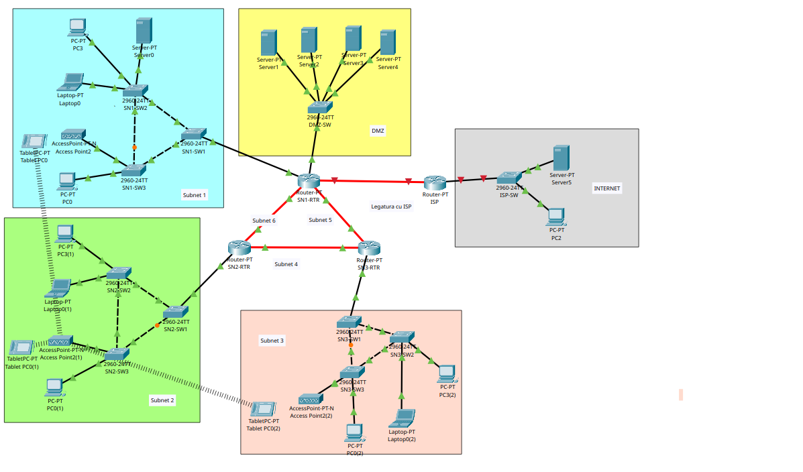

# Three-Building Campus Network

[](https://github.com/davideboss2003/Full-Network-configuration-automatization-/actions/workflows/validate.yml)

A Cisco campus network for an institution spread across three buildings: segmented
with VLANs, made redundant at both Layer 2 and Layer 3, addressed automatically,
and published to the outside through a DMZ.

Two thirds of the device configurations are **generated from a single YAML
inventory** rather than typed by hand.



---

## What it implements

| | |
|---|---|
| **Segmentation** | Two VLANs per building — users and management — carried over 802.1Q trunks |
| **Layer 2 redundancy** | Three switches per building in a triangle, resolved by Spanning Tree with an explicitly placed root |
| **Layer 3 redundancy** | Three routers in a full mesh running OSPF area 0, producing equal-cost paths |
| **Inter-VLAN routing** | 802.1Q sub-interfaces on each building router |
| **Addressing** | DHCP served by the routers; infrastructure static and excluded from the pools |
| **Wireless** | One access point per building, WPA2-PSK with AES, sharing the user VLAN with cabled hosts |
| **DMZ** | HTTP, FTP, DNS and mail on public addresses behind a dedicated switch and VLAN |
| **External link** | Point-to-point fibre to a provider router, with a simulated external network |
| **Management plane** | Hashed passwords, two privilege levels, SSH v2 only with telnet refused, authenticated console, idle timeouts |
| **Access layer** | Port security with sticky learning on every access port; VLAN hopping closed off by pinning port roles, restricting trunks and emptying VLAN 1 |

## Addressing

| Block | Purpose |
|---|---|
| `172.16.0.0/16` | Intranet — subnetted into `/24` user and management VLANs |
| `172.16.255.0/24` | Point-to-point router links, subnetted into `/30` |
| `210.1.1.64/27` | DMZ, public addresses |
| `210.1.1.32/27` | Provider link |

The VLAN identifier equals the third octet, so `172.16.20.55` reads as
*zone 2, user VLAN* without a lookup table.

| Zone | Router | User VLAN | Management VLAN |
|---|---|---|---|
| Subnet 1 | `SN1-RTR` | 10 → `172.16.10.0/24` | 110 → `172.16.110.0/24` |
| Subnet 2 | `SN2-RTR` | 20 → `172.16.20.0/24` | 120 → `172.16.120.0/24` |
| Subnet 3 | `SN3-RTR` | 30 → `172.16.30.0/24` | 130 → `172.16.130.0/24` |

---

## Configuration generation

One building was configured by hand to establish a verified baseline. The
remaining two were generated:

```
automation/inventory.yml   ──┐
                             ├──►  render.py  ──►  configs/*.cfg
automation/templates/*.j2  ──┘
```

```bash
python3 automation/render.py            # all zones
python3 automation/render.py SN1 SN3    # selected zones
```

Twelve configurations from 144 lines of inventory, in under a tenth of a second.

**Access ports are computed, not listed.** Any port not carrying a trunk becomes
an access port in the user VLAN, and the resulting numbers are collapsed into the
fewest contiguous `interface range` statements — so a switch whose trunks sit on
ports 1, 3 and 4 yields `Fa0/2` alone plus `Fa0/5-24`.

**The generator was validated against the hand-built zone.** That zone is still in
the inventory; rendering it reproduces the manual configuration exactly. The
resulting networks also converge identically:

| | Built by hand | Generated |
|---|---|---|
| Root bridge priority | 24596 | 24586 |
| Blocked port | `Fa0/2` `Altn BLK` | `Fa0/2` `Altn BLK` |
| Root port | `Fa0/4` `Root FWD` | `Fa0/4` `Root FWD` |

The difference of ten is the VLAN identifier.

Jinja2 is the engine Ansible uses internally, so the templates carry over to an
Ansible workflow unchanged. Delivery here is manual only because Packet Tracer
accepts no inbound SSH.

---

## Security

Devices originally required no authentication at all: reaching a console meant
reaching privileged mode. The baseline now applied to all thirteen devices under
our control covers hashed passwords, an operator account at privilege 5 and an
administrator at 15, RSA keys with SSH version 2 as the only permitted remote
transport, an authenticated console, idle timeouts and a login banner.

```
C:\>telnet 172.16.120.2
Trying 172.16.120.2 ...Open

[Connection to 172.16.120.2 closed by foreign host]
```

That is the result worth reading closely. The TCP connection is accepted and
then closed before any prompt appears — the session is refused by
`transport input ssh` rather than by a failed login, so no credential is ever
transmitted.

**Access ports carry port security**: two MAC addresses, learned sticky so they
survive a reload, with violations restricted rather than shutting the port down.
Trunks are deliberately excluded — they legitimately carry hundreds of addresses
— and the access-point port is given a higher limit, because an AP bridges one
MAC per wireless client and the workstation limit would block the third user to
associate.

**Credentials stay out of the repository.** They live in
`automation/secrets.yml`, which is git-ignored. `configs/` is rendered with
visible placeholders and committed; `render.py --deploy` writes the real files
to `build/`, which is not. One check fails if a value that is not a placeholder
reaches a committed file.

---

## Validation

```bash
pytest tests/ -v
```

57 checks, run on every push, in three suites.

One is a unit test in the usual sense: it covers `contiguous_ranges`, the
function that turns "every port that is not a trunk" into the fewest
`interface range` statements. The other two are configuration validation —
they cover the design and its translation into IOS separately, because the
inventory can be right while the renderer is wrong.

The design checks encode what the addressing plan depends on — VLAN identifiers
matching their third octet, SVIs inside their own subnet, one deliberate
spanning-tree root per zone, `/30` endpoints drawn from the same block, the
three routers forming a closed triangle rather than a chain.

The output checks inspect what the generator produces — trunk ports matching the
inventory, no port left in the default VLAN, DHCP excluding the reserved range,
the management VLAN kept out of DHCP so a switch cannot lose its address to an
expired lease.

Nine cover the security baseline: every device requires a privileged password,
accounts are hashed rather than stored reversibly, two privilege levels exist,
remote access is SSH v2 with telnet refused, sessions time out, and the console
is authenticated rather than left open to anyone with physical access.

One check is not about the network at all: it fails if a real credential reaches
a committed file. Passwords live in `automation/secrets.yml`, which is
git-ignored; `configs/` is rendered with visible placeholders, and
`render.py --deploy` writes the real files to `build/`.

**Each check was confirmed against deliberately broken input** — an SVI outside
its subnet, two root bridges in one zone, an asymmetric trunk, mismatched `/30`
endpoints, a committed key, a removed `enable secret`, telnet re-enabled.

Two gaps surfaced that way. One check searched the whole file for
`enable secret`, and the string also appears in a comment, so it passed with the
command deleted; it now reads configuration lines only. Another followed the
inventory rather than constraining it, so limiting the access-point port to two
MAC addresses — enough to block wireless clients as they associate — left
everything green.

The second gap is the more interesting one. **Output checks verify consistency
with the inventory; policy checks constrain what the inventory may say.** Both
are needed, or the network can be broken by editing the source of truth without
a single test turning red.

CI also re-renders the configurations and fails if `configs/` has drifted from
what `inventory.yml` produces, so the committed output cannot fall out of step
with its source.

---

## Repository

```
automation/     Inventory, Jinja2 templates, renderer
configs/        Generated device configurations
tests/          Design and output checks
docs/latex/     Technical report (LaTeX source and figures)
topology/       Packet Tracer file
```

## Report

`docs/latex/PPRC-Muresan-Davide.tex` covers the design and every configuration
step, with the verification output from the running network — spanning-tree
convergence, OSPF adjacencies and routing tables, DHCP leases, DNS resolution.

It also records what was learned in the process: why a ping failing in one
direction and succeeding in the other locates a missing default gateway, and why
a `TTL` of 254 rather than 255 proves a packet was routed rather than switched.


